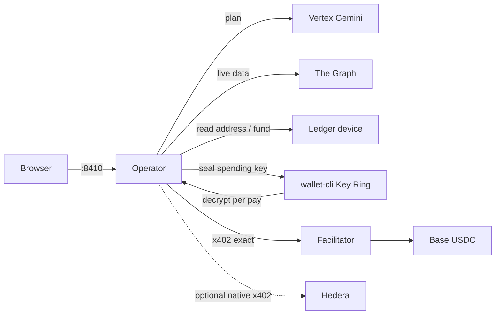

# Mandate

Ledger-backed x402 agents on **Base mainnet** (chain 8453, native USDC). The model never sees a spending key.

Describe a goal. Mandate probes unpaid prices, you approve a plan, then it pays tools inside a Ledger-funded cap. When the run ends, the agent is discarded; receipts stay.

## Architecture



One local process: `scripts/start.mjs` serves the workspace on `http://127.0.0.1:8410/`. The operator (`packages/gateway`) holds broker policy, SQLite receipts, and the x402 client. The UI is static files in `console/`.

**Trust.** Key Ring holds the spending private key. DMK on the physical Ledger confirms the payer address and the USDC allowance. Later tool payments use that sealed software wallet — USB is needed again only to raise the cap. URL allowlists and rolling limits are broker rules, not hardware.

**Rails.** The Graph (Subgraph MCP + Agent0) is load-bearing for live counterparty data. Hedera is an optional `hedera:mainnet` x402 path. A loopback facilitator on `:8406` starts automatically when `secrets/mandate-*.enc` exist.

## Run

Node **22.13+**. No secrets required to clone, install, or boot.

```sh
git clone https://github.com/Satianurag/mandate.git
cd mandate
npm ci
npm start
```

Open [http://127.0.0.1:8410/](http://127.0.0.1:8410/). Startup does not unlock a wallet, sign, or spend.

Then in the workspace: Settings (Vertex via gcloud, Base RPC, facilitator) → Ledger budget (device address, Key Ring–sealed wallet, on-device allowance) → New task.

`npm run verify` builds and runs tests. It does not need a Ledger.

Ledger install, clear-signing, and device notes: [DX.md](DX.md). AI attribution: [AI.md](AI.md).

## Layout

```
console/                 workspace UI
packages/gateway/        operator, Ledger, Graph, Hedera, x402
packages/facilitator/    self-hosted x402 facilitator
scripts/start.mjs        process entry
agent/skills/            Ledger Agent Stack skills
docs/erc7730/            USDC allowance descriptor
```

## License

[MIT](LICENSE)
